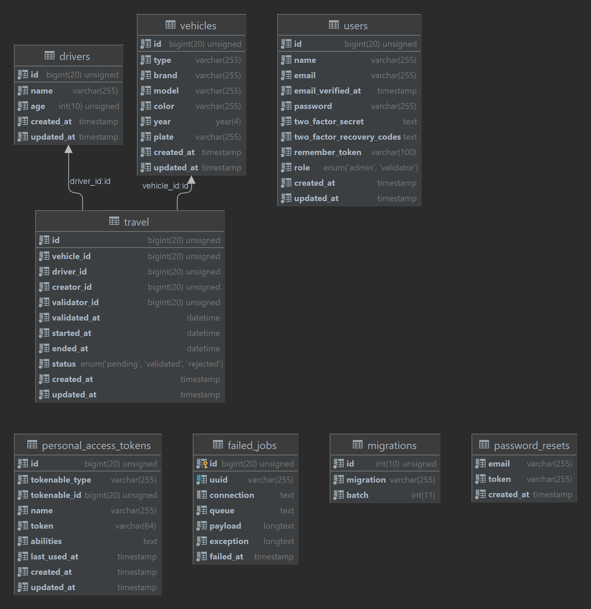

# Requirements
This project based on Laravel 9. So, this is what you need to install
- PHP 8.1+
- Composer 2
- MariaDB 10.4+
- phpMyAdmin 5.1+
- Apache 2.4+

Or you can just use XAMPP and Composer

# How To Access
Read installation carefully. Use this account below to access the app:

**_admin_**: admin@gmail.com:password<br>
**_validator_**: validator@gmail.com:password

## Installation

Clone the repository
```bash
git clone https://github.com/myxzlpltk/mine-transport-vehicle.git
```

Enter project's folder
```bash
cd mine-transport-vehicle
```

Install composer depedencies
```bash
composer install
```

Create a copy of your .env file
```bash
cp .env.example .env
```

Generate an app encryption key
```bash
php artisan key:generate
```

Create an empty database for the application.
You can use any database you want.
Fill in the `DB_HOST`, `DB_PORT`, `DB_DATABASE`, `DB_USERNAME`, and `DB_PASSWORD` options in `.env ` file to match the credentials of the database you just created.

Migrate the database
```bash
php artisan migrate
```

If you want to seed database with fake data [Optional]
```bash
php artisan db:seed
```

Start the local development server
```bash
php artisan serve
```
You can now access the server at http://localhost:8000

# Data Model

